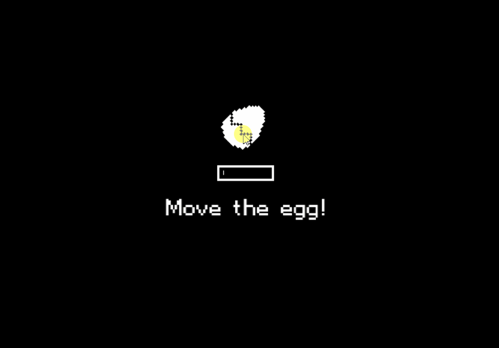

# One bit pets

### A tamagochi-like game developed with svelte.

**Not a finished game**
This is a proof of concept to see if I could create a game using pixi.js and svelte.

The game has:

- Multiple pets with up to 3 evolutions 🐔.
- A store 🛒.
- A tower defense mini-game 🎮.
- A cooking mini-game 🧑‍🍳️.

| Images                                         |                                          |
| ---------------------------------------------- | ---------------------------------------- |
| **Your first pet**                             | **Cooking**                              |
|  |      |
| **Shop**                                       | **Mini game**                            |
|                  |  |
